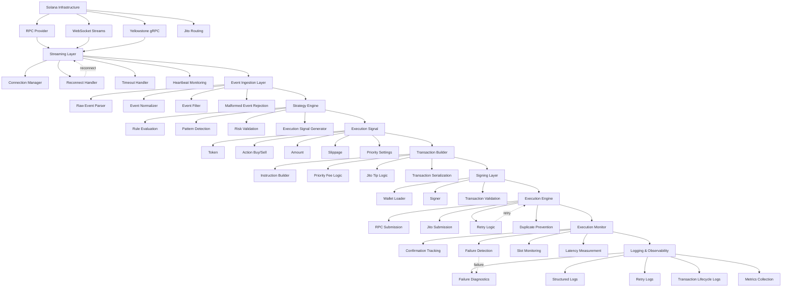

```mermaid
flowchart TD

    %% =========================
    %% INFRASTRUCTURE
    %% =========================

    A[Solana Infrastructure]

    A1[RPC Provider]
    A2[WebSocket Streams]
    A3[Yellowstone gRPC]
    A4[Jito Routing]

    A --> A1
    A --> A2
    A --> A3
    A --> A4

    %% =========================
    %% STREAMING LAYER
    %% =========================

    B[Streaming Layer]

    B1[Connection Manager]
    B2[Reconnect Handler]
    B3[Timeout Handler]
    B4[Heartbeat Monitoring]

    A1 --> B
    A2 --> B
    A3 --> B

    B --> B1
    B --> B2
    B --> B3
    B --> B4

    %% =========================
    %% EVENT INGESTION
    %% =========================

    C[Event Ingestion Layer]

    C1[Raw Event Parser]
    C2[Event Normalizer]
    C3[Event Filter]
    C4[Malformed Event Rejection]

    B --> C

    C --> C1
    C --> C2
    C --> C3
    C --> C4

    %% =========================
    %% STRATEGY ENGINE
    %% =========================

    D[Strategy Engine]

    D1[Rule Evaluation]
    D2[Pattern Detection]
    D3[Risk Validation]
    D4[Execution Signal Generator]

    C --> D

    D --> D1
    D --> D2
    D --> D3
    D --> D4

    %% =========================
    %% EXECUTION SIGNAL
    %% =========================

    E[Execution Signal]

    E1[Token]
    E2[Action Buy/Sell]
    E3[Amount]
    E4[Slippage]
    E5[Priority Settings]

    D --> E

    E --> E1
    E --> E2
    E --> E3
    E --> E4
    E --> E5

    %% =========================
    %% TRANSACTION BUILDER
    %% =========================

    F[Transaction Builder]

    F1[Instruction Builder]
    F2[Priority Fee Logic]
    F3[Jito Tip Logic]
    F4[Transaction Serialization]

    E --> F

    F --> F1
    F --> F2
    F --> F3
    F --> F4

    %% =========================
    %% SIGNING LAYER
    %% =========================

    G[Signing Layer]

    G1[Wallet Loader]
    G2[Signer]
    G3[Transaction Validation]

    F --> G

    G --> G1
    G --> G2
    G --> G3

    %% =========================
    %% EXECUTION ENGINE
    %% =========================

    H[Execution Engine]

    H1[RPC Submission]
    H2[Jito Submission]
    H3[Retry Logic]
    H4[Duplicate Prevention]

    G --> H

    H --> H1
    H --> H2
    H --> H3
    H --> H4

    %% =========================
    %% EXECUTION MONITOR
    %% =========================

    I[Execution Monitor]

    I1[Confirmation Tracking]
    I2[Failure Detection]
    I3[Slot Monitoring]
    I4[Latency Measurement]

    H --> I

    I --> I1
    I --> I2
    I --> I3
    I --> I4

    %% =========================
    %% OBSERVABILITY
    %% =========================

    J[Logging & Observability]

    J1[Structured Logs]
    J2[Retry Logs]
    J3[Transaction Lifecycle Logs]
    J4[Metrics Collection]
    J5[Failure Diagnostics]

    I --> J

    J --> J1
    J --> J2
    J --> J3
    J --> J4
    J --> J5

    %% =========================
    %% FAILURE PATHS
    %% =========================

    B2 -. reconnect .-> B
    H3 -. retry .-> H
    I2 -. failure .-> J5
```
